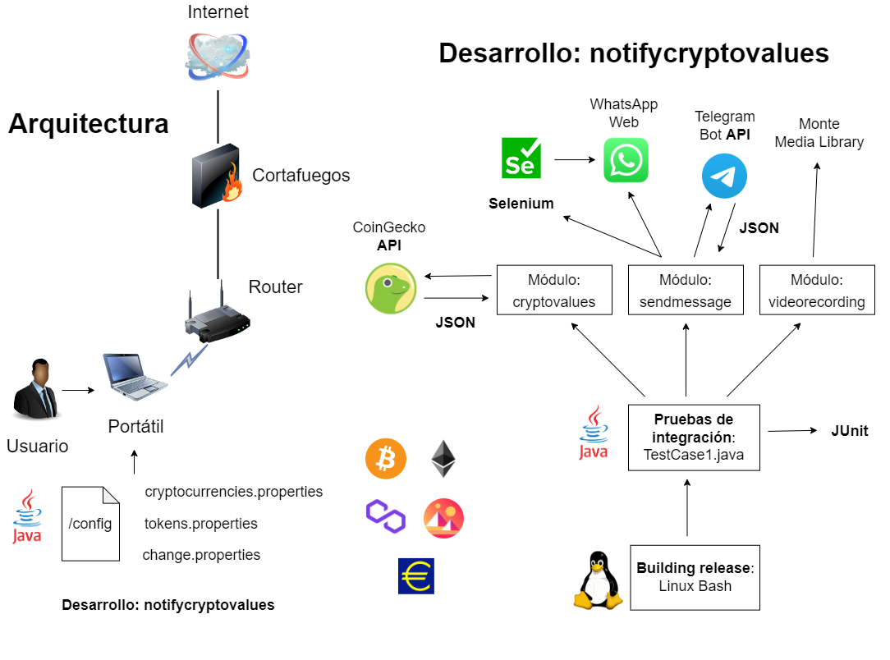
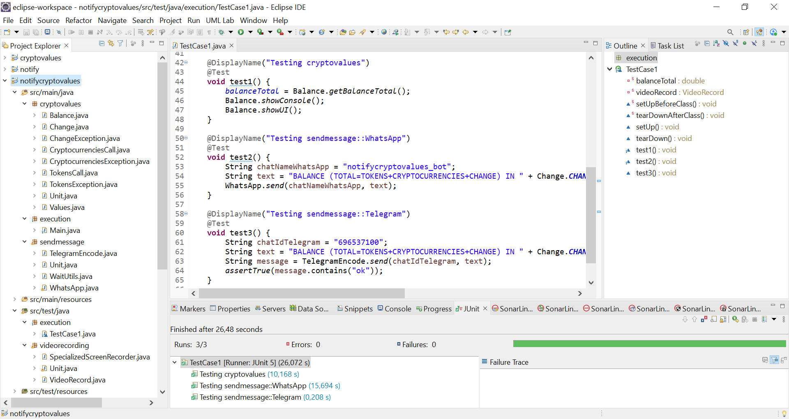

# notifycryptovalues

Checking balance without logging into crypto wallet

## Application context

Bitcoin [Nakamoto 08] was the first application of Blockchain technology. Bitcoin solved the problem of double spending without the need for a trusted authority or central server (traditionally banking systems). Interest in Bitcoin and other cryptocurrencies (for example, ETH from Ethereum) has increased considerably in recent years [Romero 22]. However, cryptocurrency prices are very volatile.

On the other hand, access to the digital wallet (crypto wallet) has been susceptible to cyberattacks. Computer attacks such as Man-in-the-Middle (MitM) have been reported in the literature. And both software and hardware wallets have been affected.

During the development life cycle (SDLC), the following tasks are included: Software QA and testing (Selenium and JUnit), video evidence of test cases (Monte Media Library) and building release automation (Linux Bash). The user interface of the application is CLI. The resulting source code is released under the GPL license. For the future we propose another building release automation (Docker), vulnerability scanning (Dive and Trivy), monitoring (Scope) and continuous integration (Jenkins).

## Input

cryptocurrencies.properties, tokens.properties and change.properties config files.

For example,

cryptocurrencies.properties

```
cryptocurrency1name=Bitcoin
cryptocurrency1quantity=0.15
cryptocurrency2name=Ethereum
cryptocurrency2quantity=0.50
cryptocurrency3name=Zcash
cryptocurrency3quantity=5
cryptocurrency4name=Cardano
cryptocurrency4quantity=100
```

tokens.properties

```
token1contract=0x7D1AfA7B718fb893dB30A3aBc0Cfc608AaCfeBB0
token1name=Polygon
token1quantity=1020.25
token2contract=0x1f9840a85d5af5bf1d1762f925bdaddc4201f984
token2name=Uniswap
token2quantity=20.50
token3contract=0x0f5d2fb29fb7d3cfee444a200298f468908cc942
token3name=Decentraland
token3quantity=80.75
```

change.properties

```
changevalue=2500
```

## Output

The balance is notified via console, GUI, and personal WhatsApp and Telegram chats.

For example,

the standard output is as follows:

```
Contract address: 0x1f9840a85d5af5bf1d1762f925bdaddc4201f984
Name: UNISWAP
Value in eur: 5.3
Quantity: 20.5

Contract address: 0x0f5d2fb29fb7d3cfee444a200298f468908cc942
Name: DECENTRALAND
Value in eur: 0.97263
Quantity: 80.75

Contract address: 0x7d1afa7b718fb893db30a3abc0cfc608aacfebb0
Name: POLYGON
Value in eur: 0.580212
Quantity: 1020.25

BALANCE (TOKENS) IN EUR: 779.15

Name: ETHEREUM
Value in eur: 1179.42
Quantity: 0.5

Name: CARDANO
Value in eur: 0.489696
Quantity: 100.0

Name: ZCASH
Value in eur: 65.23
Quantity: 5.0

Name: BITCOIN
Value in eur: 20316.0
Quantity: 0.15

BALANCE (CRYPTOCURRENCIES) IN EUR: 4012.23

BALANCE (TOKENS) IN EUR: 779.15

BALANCE (CHANGE) IN EUR: 2500.00

BALANCE (TOTAL=TOKENS+CRYPTOCURRENCIES+CHANGE) IN EUR: 7291.38

CURRENT TIME: 11:43:56
```

## Architecture



## Testing

For each module, Unit.java contains the unit test.

TestCase1.java contains the integration test (see image). 



## Usage

Edit these variables in the source code:

chatNameWhatsApp
chatIdTelegram
apiToken

In:

notifycryptovalues\src\main\java\execution\Main.java

```
public class Main {

	public static void main(String[] args) {
		
		String chatNameWhatsApp = "to complete";
		String chatIdTelegram = "to complete";
```

In:

notifycryptovalues\src\main\java\sendmessage\Unit.java

```
public class Unit {

	public static void main(String[] args) {
		
		String chatNameWhatsApp = "to complete";
		String chatIdTelegram = "to complete";
```

In:

notifycryptovalues\src\main\java\sendmessage\TelegramEncode.java

```
String apiToken = "to complete";
```

In:

notifycryptovalues\src\test\java\execution\TestCase1.java

```
@DisplayName("Testing sendmessage::WhatsApp")
@Test
void test2() {
	String chatNameWhatsApp = "to complete";

@DisplayName("Testing sendmessage::Telegram")
@Test
void test3() {
	String chatIdTelegram = "to complete";
```

## Demo


Available at: https://youtu.be/YFOZz-PgefQ

## Deliverable

that includes:

1. Java EE Eclipse project with the source code. You should use Maven build because the project is clean.
2. config folder.
3. A demo video.
4. An explanation [file](tutorial/explanation.pdf) (to get the Telegram API token, etc.).

Download the files as a zip using the green button, or clone the repository to your machine using Git.

## References

[Nakamoto 08] S. Nakamoto. "Bitcoin: A Peer-to-Peer Electronic Cash System". 31 October 2008. Available at: https://bitcoin.org/bitcoin.pdf

[Romero 22] J.M. Romero. "A comparative analysis between Bitcoin and Ethereum developer communities through Microsoft Power BI and GitHub". Internal report. Capgemini. April 2022.
